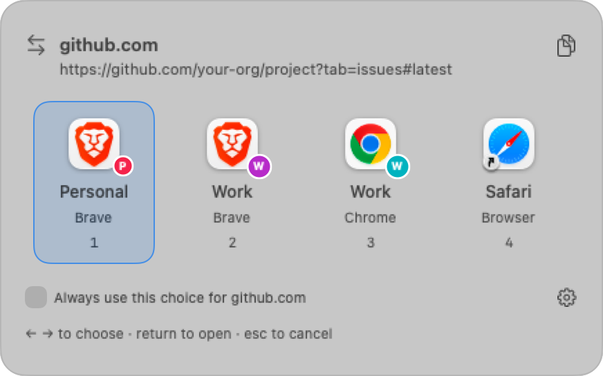

# Switcheroo

A small macOS menu bar app that asks which browser or profile to use when you click a link.

<picture>
  <source media="(prefers-color-scheme: dark)" srcset="docs/picker-dark.png">
  
</picture>

If you switch between a work profile and a personal one, links from Slack or Mail usually land in whichever profile you used last. Switcheroo becomes your default browser, shows a small picker next to your cursor, and passes the link to the one you choose. For sites that always go to the same place, tick "Always use this choice" and it stops asking.

## Features

- Picks up your Brave, Chrome, and Edge profiles automatically. Safari and Firefox show up as regular browsers.
- Works from the keyboard: number keys, arrows, Return, and Escape.
- Per-site rules, so `github.com` can always open in your work profile.
- Stays in the menu bar and can launch at login. No accounts, no network calls, no history.

## Install

You'll need macOS 14 or later and Swift 6, which comes with Xcode 16 or later.

```sh
git clone https://github.com/DevSlashNulled/switcheroo.git
cd switcheroo
./scripts/install.sh
```

This builds the app, copies it into `/Applications` (or `~/Applications` if that isn't writable), and opens it. To pick the folder yourself, pass it as an argument: `./scripts/install.sh ~/Applications`.

To update, pull and run the same command again. Your settings carry over. If Switcheroo still has unopened links, it asks before quitting, and the installer won't replace a copy that's still running.

There's no prebuilt download because the app isn't notarized. You build it on your own Mac.

## Getting started

The first time Switcheroo opens, it shows a setup window:

1. Your browser profiles are listed and already checked. Uncheck any you don't want in the picker, and use the arrows to reorder them.
2. If a browser shows a **Connect** button, click it and then **Allow**. macOS needs your permission before Switcheroo can read profile names, and the right folder is already selected. If it shows **Open** instead, that browser hasn't been set up yet. Open it, finish its setup, and come back.
3. Click **Make Switcheroo my link picker** and accept the macOS prompt.

Click a link in another app to try it out. You can skip step 3 with **Set up later** and turn it on from **Settings → General** whenever you like.

## Using the picker

| Key | Action |
| --- | --- |
| `1` to `9` | Open in that choice |
| `←` `→`, then `Return` | Move between choices and open |
| `Space` | Toggle "Always use this choice for…" |
| `⌘C` | Copy the link |
| `⌘,` | Open Settings |
| `Esc` | Cancel |

Clicking outside the picker also cancels. When several links arrive at once, they wait in line and the picker shows them one at a time.

## Website rules

A rule sends every link for one hostname straight to a browser or profile. Matching is exact. A rule for `github.com` covers every page on `github.com` but not `gist.github.com`. You can add rules from the picker or under **Settings → Website Rules**.

If a rule points at a profile that no longer exists, you get the picker instead. To ignore all rules for a while, choose **Pause website rules** from the menu bar icon. They come back when you unpause or restart the app.

## Good to know

- Links clicked inside a browser stay in that browser. Switcheroo only sees links opened from other apps.
- Some apps always open a specific browser and skip the system default.
- Profiles are read from each browser's standard folder in `~/Library/Application Support`. Custom `--user-data-dir` setups aren't picked up.
- Switcheroo reads profile names only and never changes browser data.
- Settings are stored in `UserDefaults` under `local.switcheroo.app`. Pending links are only kept in memory.

## Uninstall

1. Choose another default browser in **System Settings → Desktop & Dock**.
2. If you turned on **Launch at login**, turn it off in **Settings → General**.
3. Quit Switcheroo from its menu bar icon and delete it from Applications.
4. To clear its settings too, run `defaults delete local.switcheroo.app`.

## Development

```sh
swift test            # logic and settings tests
./scripts/build.sh    # builds dist/Switcheroo.app without installing
```

Run `swift test` with `SWITCHEROO_CAPTURE_DIR` set to also run the UI tests. They open real windows and save screenshots to that folder. The `scripts/smoke-*.py` scripts check real browser launches using throwaway profiles, and `scripts/check-runtime.py` measures idle CPU and memory for a release build.

## License

[MIT](LICENSE)
